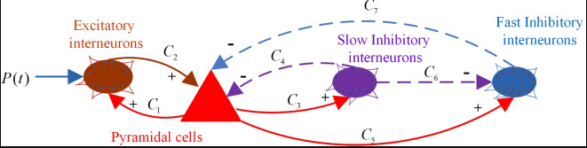
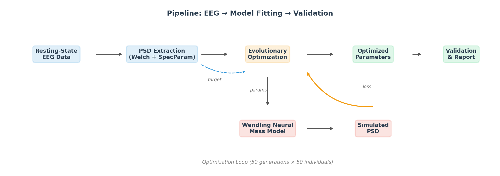
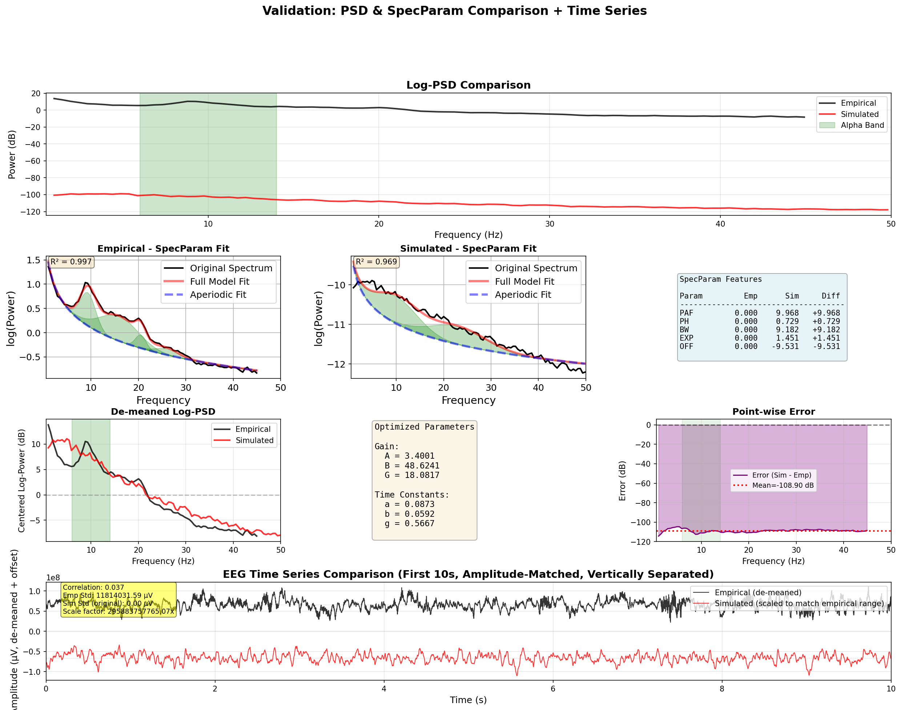
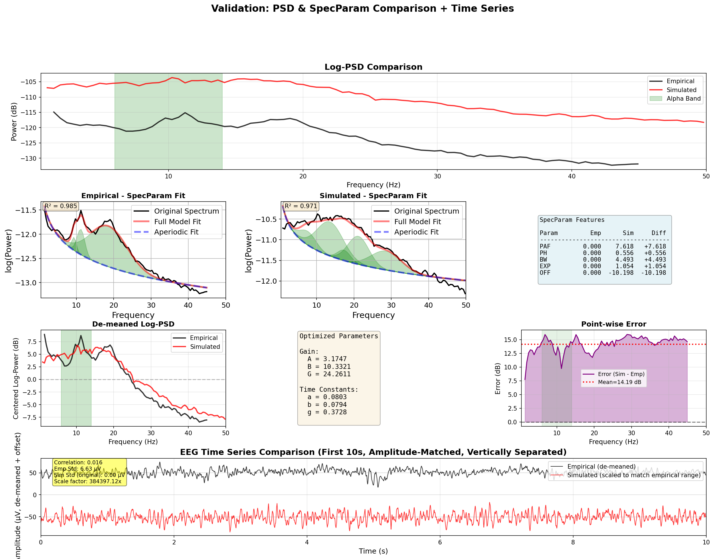
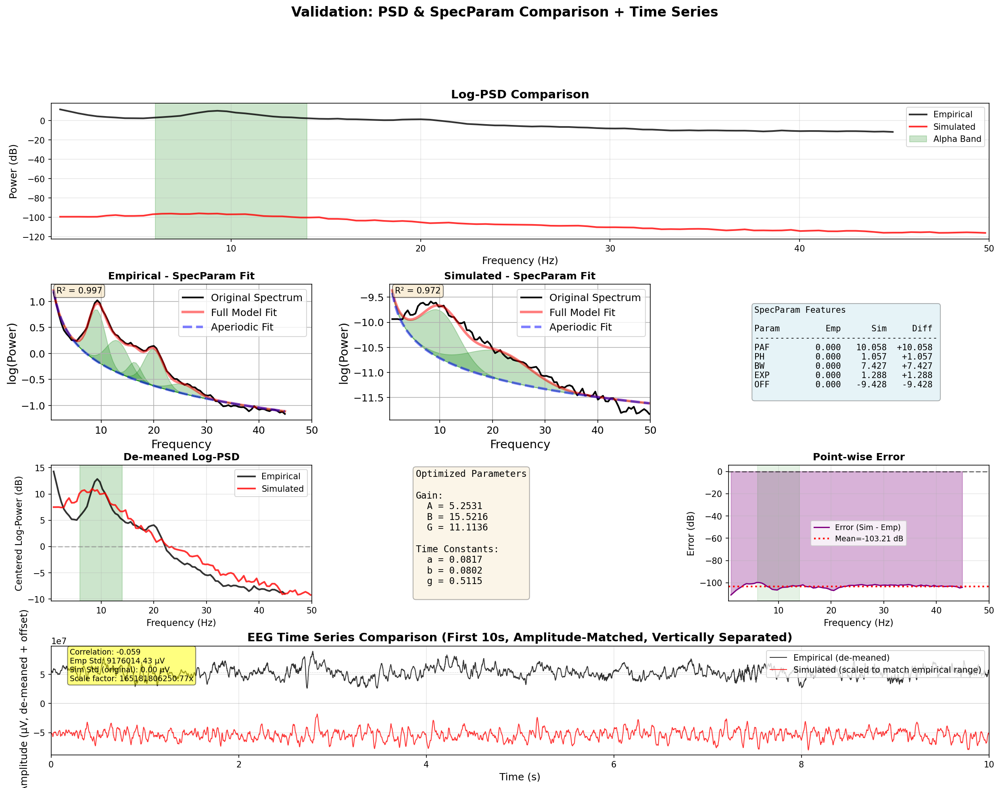
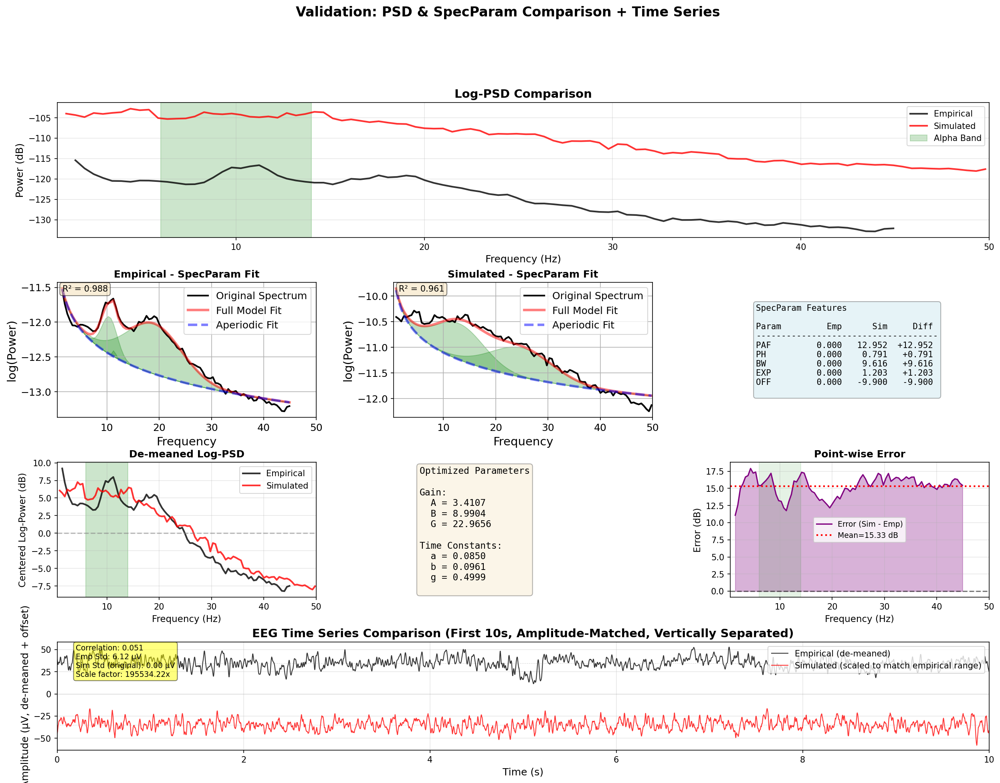
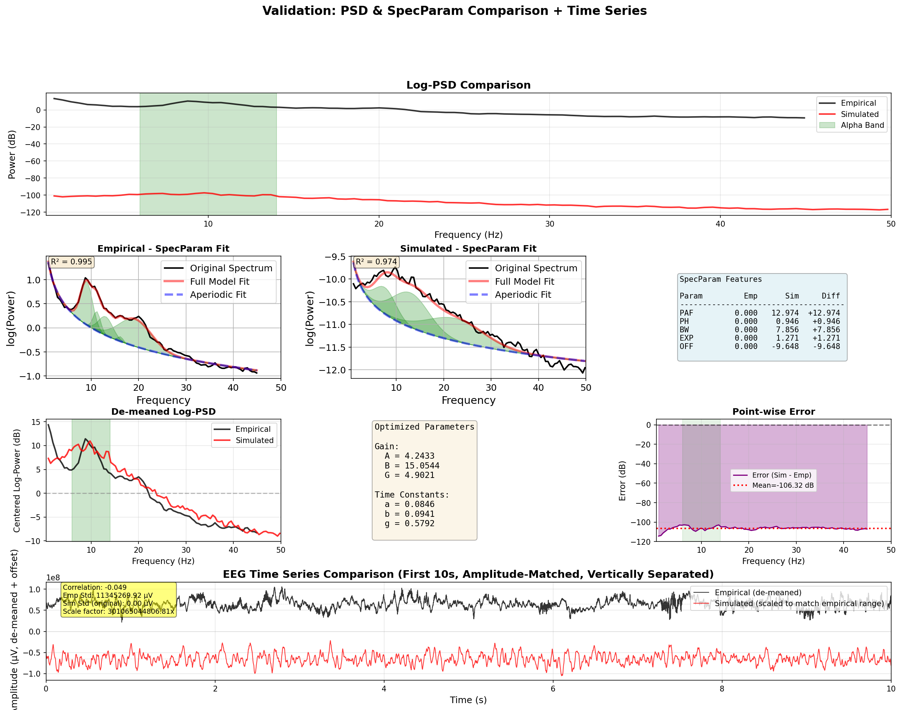
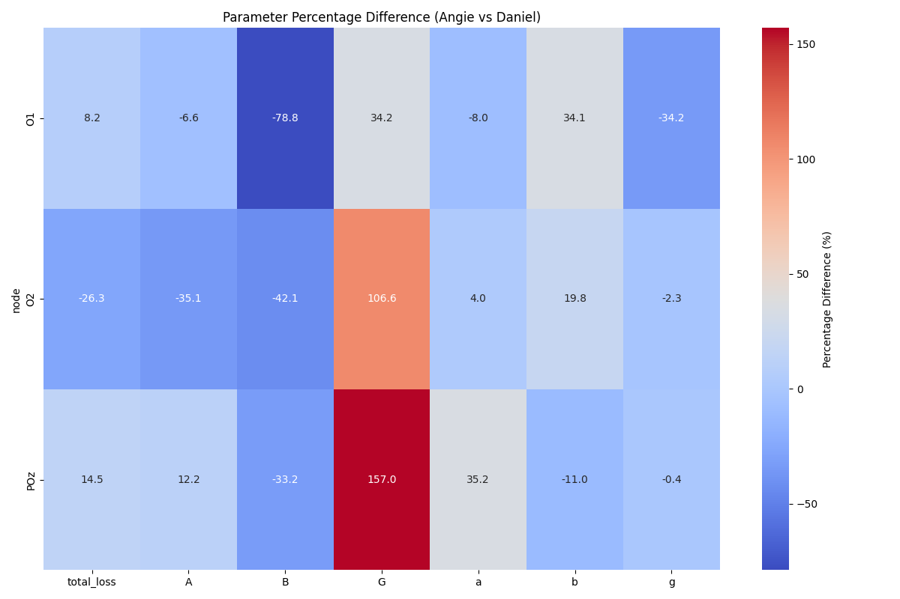
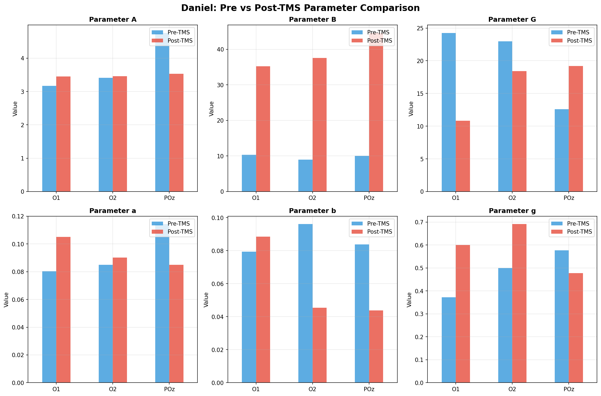
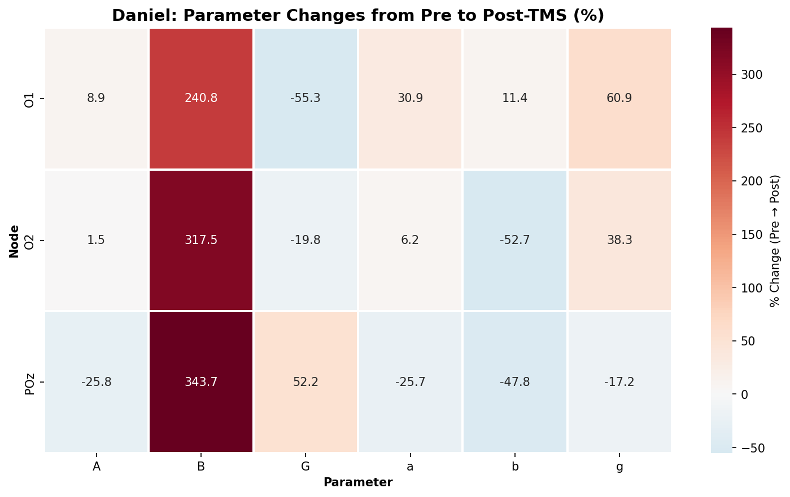

# 🧠 Fitting Wendling Neural Mass Model to Resting-State EEG

> **Estimating cortical excitation–inhibition balance from scalp EEG using evolutionary optimization**

[](https://python.org)
[](https://github.com/neurolib-dev/neurolib)
[](LICENSE)

---

## Overview

This project fits the **Wendling neural mass model** — a biophysical model of cortical column dynamics — to **empirical resting-state EEG** recordings. By matching simulated power spectral density (PSD) to real EEG spectra via evolutionary optimization, we extract physiologically interpretable parameters that quantify excitatory–inhibitory (E/I) balance in the brain.

We apply this pipeline to two subjects (**Healthy Control** vs **Epilepsy Patient**) across three occipital EEG channels (O1, O2, POz), and further examine how model parameters change **before and after TMS treatment** in the patient. The results reveal consistent neurophysiological signatures: reduced slow inhibition (B ↓ 51%) and elevated fast inhibition (G ↑ 99%) in the patient relative to the healthy control — and a dramatic recovery of slow inhibition (B ↑ 240–343%) following TMS.

---

## Model Architecture

The Wendling model describes a cortical column with **four interacting neural populations**: pyramidal cells, excitatory interneurons, slow inhibitory (GABA_B) interneurons, and fast inhibitory (GABA_A) interneurons.

<p align="center">
  
</p>

**Key parameters:**
| Symbol | Description | Role |
|--------|-------------|------|
| **A** | Excitatory synaptic gain (AMPA) | Amplifies excitatory PSPs |
| **B** | Slow inhibitory gain (GABA_B) | Controls slow inhibition strength |
| **G** | Fast inhibitory gain (GABA_A) | Controls fast inhibition strength |
| **a, b, g** | Membrane time constants | Shape of PSP waveforms |

---

## Pipeline

<p align="center">
  
</p>

**Steps:**
1. **EEG preprocessing** → Extract resting-state data from O1, O2, POz channels
2. **Feature extraction** → Compute log-PSD (1–45 Hz) + SpecParam features (alpha peak, 1/f exponent)
3. **Evolutionary optimization** → Search Wendling parameter space (50 generations × 50 individuals) to minimize a multi-objective loss:

```
L_total = 0.7 × L_PSD  +  0.3 × L_SpecParam

where  L_PSD     = Weighted MSE on log-PSD (1–45 Hz)
       L_SpecParam = MSE on alpha peak frequency, height, bandwidth, 1/f exponent
```

4. **Validation** → Re-run best parameters, compare simulated vs empirical PSD, SpecParam features, and time series

---

## Results: Healthy Control vs Epilepsy Patient

### Validation Plots

Each validation panel shows: log-PSD comparison, SpecParam fit (empirical & simulated), de-meaned PSD overlay, optimized parameters, pointwise error, and time series comparison.

#### O1 Channel

| Healthy Control | Patient |
|:-:|:-:|
|  |  |

#### O2 Channel

| Healthy Control | Patient |
|:-:|:-:|
|  |  |

#### POz Channel

| Healthy Control | Patient |
|:-:|:-:|
|  |  |

### Parameter Comparison

| Parameter | O1 Diff | O2 Diff | POz Diff | Avg Diff | Trend |
|-----------|---------|---------|----------|----------|:-----:|
| **A** (excitatory gain) | −6.8% | −35.1% | +12.3% | −9.9% | ↓ |
| **B** (slow inhibitory gain) | **−78.8%** | **−42.1%** | **−33.2%** | **−51.4%** | **↓↓↓** |
| **G** (fast inhibitory gain) | **+34.2%** | **+106.8%** | **+157.1%** | **+99.4%** | **↑↑↑** |
| **a** (excitatory time const) | −8.1% | +3.7% | +34.1% | +9.9% | ↑ |
| **b** (slow inhib time const) | +33.9% | +20.0% | −10.6% | +14.4% | ↑ |
| **g** (fast inhib time const) | −34.2% | −2.2% | −0.4% | −12.2% | ↓ |

> *Differences are computed as (Patient − Healthy) / Healthy × 100%*

<p align="center">
  
</p>

### Key Finding

The patient consistently shows:
- **B ↓ 51%** — Reduced slow (GABA_B) inhibition across all channels
- **G ↑ 99%** — Elevated fast (GABA_A) inhibition, possibly a compensatory mechanism

This aligns with the **impaired GABAergic dendritic inhibition** hypothesis in epilepsy (Wendling et al., 2002).

---

## Results: Pre vs Post-TMS (Patient)

After transcranial magnetic stimulation (TMS), the patient's Wendling model parameters shift dramatically — most notably a recovery of slow inhibition.

<p align="center">
  
</p>

<p align="center">
  
</p>

### TMS-Induced Parameter Changes

| Parameter | O1 Change | O2 Change | POz Change | Interpretation |
|-----------|-----------|-----------|------------|----------------|
| **B** | **+241%** | **+318%** | **+344%** | Massive recovery of slow inhibition |
| **G** | −55% | −20% | +52% | Variable fast inhibition response |
| **b** | +11% | −53% | −48% | Altered slow inhibitory dynamics |
| **g** | +61% | +38% | −17% | Altered fast inhibitory dynamics |

### Key Finding

**B parameter increases 240–344% after TMS** across all channels, suggesting that TMS may restore slow inhibitory (GABA_B) function. This is consistent with the hypothesis that TMS modulates cortical inhibition in epilepsy.

---

## Summary of Findings

| Comparison | Key Result | Interpretation |
|------------|------------|----------------|
| Patient vs Healthy | B ↓ 51%, G ↑ 99% | Impaired slow inhibition + compensatory fast inhibition |
| Post-TMS vs Pre-TMS | B ↑ 240–344% | TMS restores slow inhibitory function |

These results demonstrate that **computational modeling of EEG can quantify excitation–inhibition imbalance** and track treatment effects at the circuit level.

---

## Tech Stack

| Component | Tool |
|-----------|------|
| **Neural mass model** | [neurolib](https://github.com/neurolib-dev/neurolib) (Wendling model) |
| **Optimization** | Evolutionary algorithm (DEAP via neurolib) |
| **EEG processing** | MNE-Python |
| **Spectral analysis** | SciPy (Welch PSD), SpecParam/FOOOF |
| **Visualization** | Matplotlib |
| **Language** | Python 3.9+ |

---

## How to Reproduce

### Prerequisites
- Python 3.9+
- [neurolib](https://github.com/neurolib-dev/neurolib) with the custom Wendling extension: [neurolib-wendling](https://github.com/changtommy16/neurolib-wendling)

### Installation

```bash
# Clone this repo
git clone https://github.com/changtommy16/wendling-eeg-fitting.git

# Install dependencies
pip install neurolib mne scipy numpy matplotlib specparam

# Install the Wendling model extension
pip install -e path/to/neurolib-wendling
```

### Running the Pipeline

```python
from neurolib_wendling.models.wendling import WendlingModel
import numpy as np

# 1. Set up single-node model
model = WendlingModel(
    Cmat=np.array([[0]]), Dmat=np.array([[0]]),
    heterogeneity=0, random_init=False, seed=42
)

# 2. Configure parameters
model.params['B'] = 10.0    # Slow inhibitory gain
model.params['G'] = 15.0    # Fast inhibitory gain
model.params['A'] = 5.0     # Excitatory gain
model.params['duration'] = 60000  # 60 seconds

# 3. Run simulation
model.run()

# 4. Extract output signal (pyramidal cell PSP)
v_pyr = model.y1[0,:] - model.y2[0,:] - model.y3[0,:]
```

For full optimization pipeline details, see the [neurolib-wendling](https://github.com/changtommy16/neurolib-wendling) repository.

---

## References

- **Wendling et al. (2002)** — *Epileptic fast activity can be explained by a model of impaired GABAergic dendritic inhibition.* European Journal of Neuroscience.
- **Cakan et al. (2021)** — *neurolib: A Simulation Framework for Whole-Brain Neural Mass Modeling.* Cognitive Computation.
- **Donoghue et al. (2020)** — *Parameterizing neural power spectra into periodic and aperiodic components.* Nature Neuroscience.

---

## License

This project is licensed under the MIT License. See [LICENSE](LICENSE) for details.

---

## Related Repositories

- [**neurolib-wendling**](https://github.com/changtommy16/neurolib-wendling) — Custom Wendling neural mass model extension for neurolib (model code + demo)
