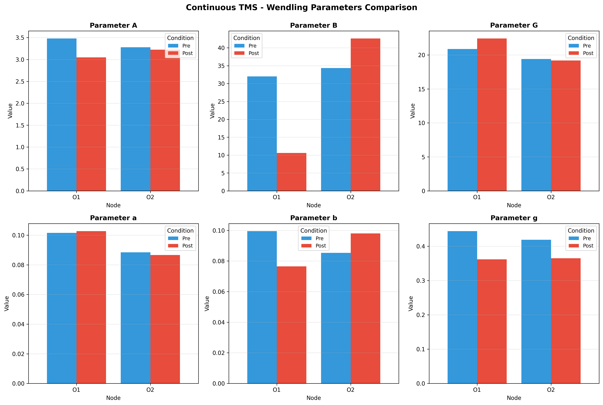
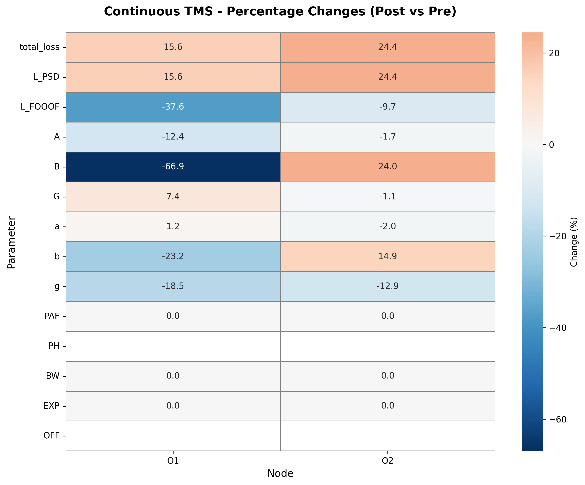
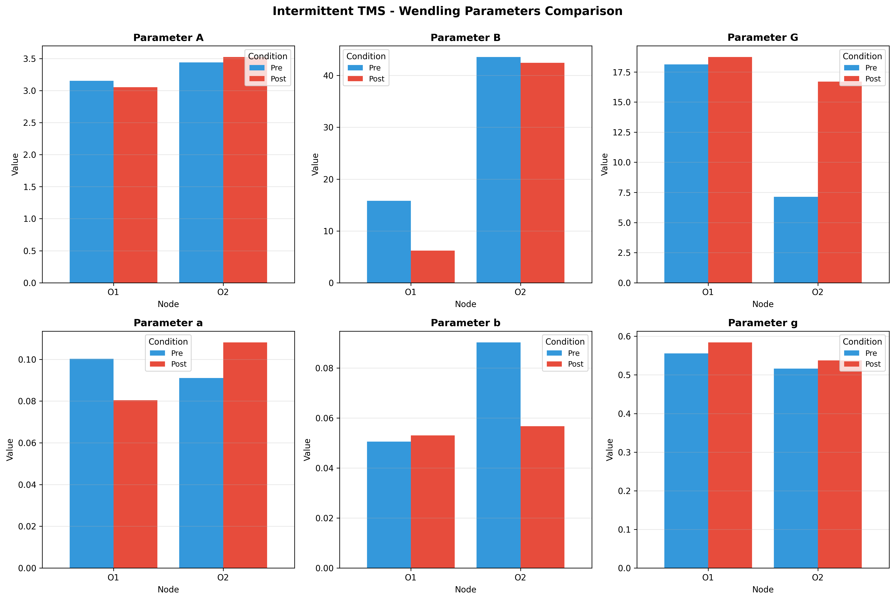
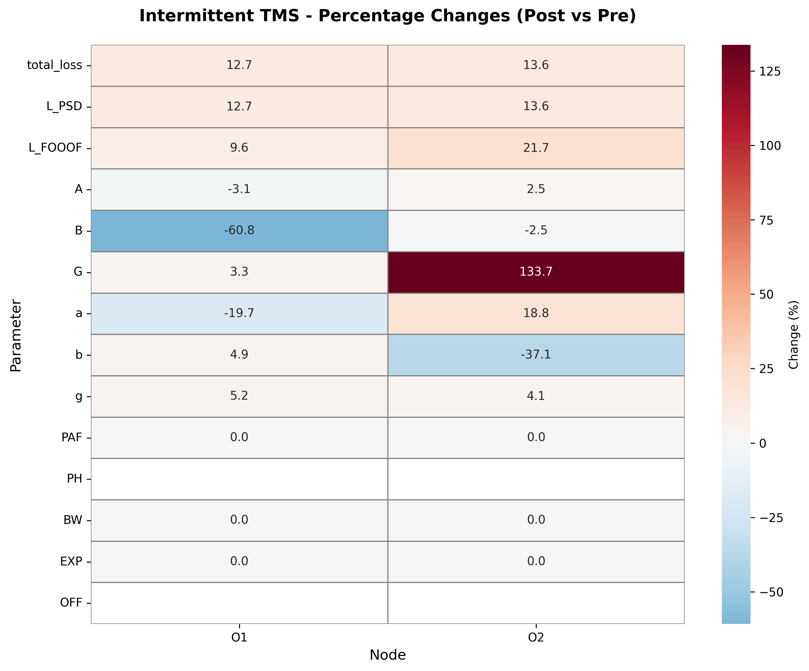

# TMS Modeling Demo: Wendling Neural Mass Model for Resting-State EEG

> **A practice project for fitting a biophysical neural mass model to EEG and exploring pre/post TMS parameter changes.**

[](https://python.org)
[](https://github.com/neurolib-dev/neurolib)
[](LICENSE)

---

## Overview

This repository is a public demo of an exploratory modeling workflow. It fits the **Wendling neural mass model**, a biophysical cortical-column model, to **resting-state EEG** by matching simulated and empirical power spectral density (PSD). The goal is to practice an end-to-end modeling pipeline: EEG preprocessing, spectral feature extraction, parameter optimization, validation plots, and presentation-ready reporting.

The original local project also explored pre/post TMS data under two protocol-style conditions:

- **Continuous TMS**, treated here as the inhibitory-like protocol label.
- **Intermittent TMS**, treated here as the excitatory-like protocol label.

The TMS results in this repo should be read as a **method demo**, not as clinical evidence. In the local analysis notes, the TMS fitting quality was flagged as weak: SpecParam/FOOOF targets fell back to default values, alpha peak constraints were unreliable, and the optimizer relied mostly on PSD shape. The parameter changes are therefore useful for demonstrating the workflow, but not for claiming a reliable treatment effect.

Raw EEG recordings are intentionally excluded from this public repository.

---

## Model Architecture

The Wendling model describes a cortical column with **four interacting neural populations**: pyramidal cells, excitatory interneurons, slow inhibitory interneurons, and fast inhibitory interneurons. The schematic below was drawn specifically for this demo so the repository does not reuse a paper figure.

<p align="center">
  
</p>

**Key parameters:**

| Symbol | Description | Role |
|--------|-------------|------|
| **A** | Excitatory synaptic gain | Amplifies excitatory PSPs |
| **B** | Slow inhibitory gain | Controls slow inhibition strength |
| **G** | Fast inhibitory gain | Controls fast inhibition strength |
| **a, b, g** | Synaptic time constants | Shape the PSP waveforms |

---

## Pipeline

<p align="center">
  
</p>

**Steps:**

1. **EEG preprocessing** -> Extract resting-state data from O1, O2, and POz channels.
2. **Feature extraction** -> Compute log-PSD and spectral features.
3. **Evolutionary optimization** -> Search the Wendling parameter space to minimize a weighted objective.
4. **Validation** -> Re-run the best parameters and compare simulated vs empirical PSD, spectral features, and time series.

```text
L_total = 0.7 x L_PSD  +  0.3 x L_SpecParam

where  L_PSD       = weighted MSE on log-PSD
       L_SpecParam = MSE on alpha peak frequency, height, bandwidth, and 1/f exponent
```

---

## Healthy Control vs Epilepsy Patient

These plots show an initial subject-comparison exercise across occipital channels. They are included as a modeling demonstration and should be interpreted cautiously because the dataset is small.

### Validation Plots

Each validation panel shows log-PSD comparison, SpecParam fit, de-meaned PSD overlay, optimized parameters, pointwise error, and time-series comparison.

#### O1 Channel

| Healthy Control | Patient |
|:-:|:-:|
|  |  |

#### O2 Channel

| Healthy Control | Patient |
|:-:|:-:|
|  |  |

#### POz Channel

| Healthy Control | Patient |
|:-:|:-:|
|  |  |

### Parameter Comparison

| Parameter | O1 Diff | O2 Diff | POz Diff | Avg Diff | Direction |
|-----------|---------|---------|----------|----------|:---------:|
| **A** | -6.8% | -35.1% | +12.3% | -9.9% | mixed |
| **B** | **-78.8%** | **-42.1%** | **-33.2%** | **-51.4%** | lower |
| **G** | **+34.2%** | **+106.8%** | **+157.1%** | **+99.4%** | higher |
| **a** | -8.1% | +3.7% | +34.1% | +9.9% | mixed |
| **b** | +33.9% | +20.0% | -10.6% | +14.4% | mixed |
| **g** | -34.2% | -2.2% | -0.4% | -12.2% | lower |

> Differences are computed as `(Patient - Healthy) / Healthy x 100%`.

<p align="center">
  
</p>

---

## Exploratory TMS Practice Analysis

The local analysis included two pre/post TMS protocol folders. I keep both in this public demo instead of choosing one as the "correct" result.

### Continuous TMS

The continuous protocol showed inconsistent parameter movement across O1 and O2. For example, B decreased strongly in O1 but increased in O2. This is a useful warning sign for a demo because similar losses can still produce non-unique parameter solutions.

| Fitted Parameters | Percentage Changes |
|:-:|:-:|
|  |  |

### Intermittent TMS

The intermittent protocol also showed unstable or channel-dependent parameter changes, including a large G increase in O2 and a much smaller change in O1.

| Fitted Parameters | Percentage Changes |
|:-:|:-:|
|  |  |

### Reliability Caveat

These TMS outputs are not strong enough to support a biological conclusion. The original local report flagged three main issues:

- SpecParam/FOOOF fitting failed for the TMS runs, so peak-frequency targets were mostly defaults.
- Several parameters moved in opposite directions across O1/O2 or changed by very different magnitudes.
- The optimization may be under-constrained because different parameter combinations can produce similar PSDs.

For this reason, the TMS section is best described as **workflow practice**: it demonstrates how a pre/post modeling comparison can be organized, while also showing why fit quality, convergence, and parameter identifiability need to be checked before interpretation.

---

## Tech Stack

| Component | Tool |
|-----------|------|
| **Neural mass model** | [neurolib](https://github.com/neurolib-dev/neurolib) with a Wendling extension |
| **Optimization** | Evolutionary / multi-objective parameter search |
| **EEG processing** | MNE-Python |
| **Spectral analysis** | SciPy Welch PSD, SpecParam/FOOOF |
| **Visualization** | Matplotlib |
| **Language** | Python 3.9+ |

---

## How to Reproduce

### Prerequisites

- Python 3.9+
- [neurolib](https://github.com/neurolib-dev/neurolib)
- The custom Wendling model extension: [neurolib-wendling](https://github.com/changtommy16/neurolib-wendling)

### Installation

```bash
git clone https://github.com/changtommy16/TMS_modeling_demo.git
cd TMS_modeling_demo

pip install neurolib mne scipy numpy matplotlib specparam
pip install -e path/to/neurolib-wendling
```

### Minimal Model Run

```python
from neurolib_wendling.models.wendling import WendlingModel
import numpy as np

model = WendlingModel(
    Cmat=np.array([[0]]),
    Dmat=np.array([[0]]),
    heterogeneity=0,
    random_init=False,
    seed=42,
)

model.params["A"] = 5.0
model.params["B"] = 10.0
model.params["G"] = 15.0
model.params["duration"] = 60000

model.run()

v_pyr = model.y1[0, :] - model.y2[0, :] - model.y3[0, :]
```

Exact raw-data reruns require local EEG files, which are not included in this public demo.

---

## References

- **Wendling et al. (2002)** - *Epileptic fast activity can be explained by a model of impaired GABAergic dendritic inhibition.* European Journal of Neuroscience.
- **Cakan et al. (2021)** - *neurolib: A Simulation Framework for Whole-Brain Neural Mass Modeling.* Cognitive Computation.
- **Donoghue et al. (2020)** - *Parameterizing neural power spectra into periodic and aperiodic components.* Nature Neuroscience.

---

## License

This project is licensed under the MIT License. See [LICENSE](LICENSE) for details.

---

## Related Repositories

- [**neurolib-wendling**](https://github.com/changtommy16/neurolib-wendling) - Custom Wendling neural mass model extension for neurolib.
